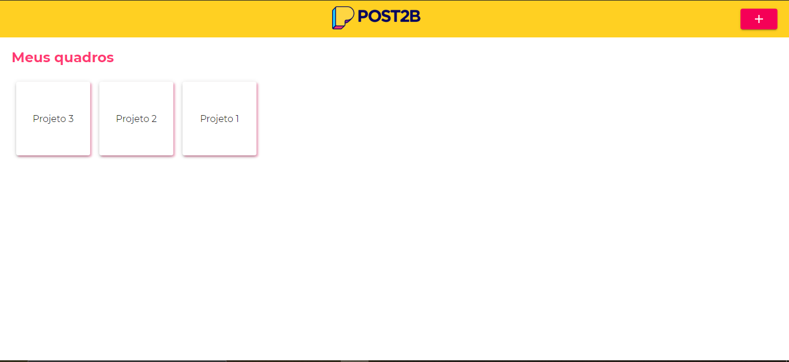
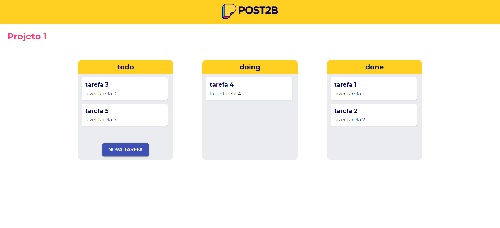

# Post2b



### App para organização de tarefas. Crie quadros e tarefas e organize-as a medida que for finalizando.

### Para utilizar este app

```bash
# Clone o repositório
git clone https://github.com/WesleyyRafaell/post2b

# Entre na pasta que foi gerada
cd post2b 

# Execute o comando
yarn start
```

### Bibliotecas utilizadas
```bash
* material-ui
* firebase
* immer
* react-hook-form
* hookform/resolvers
* uid
* yup
```